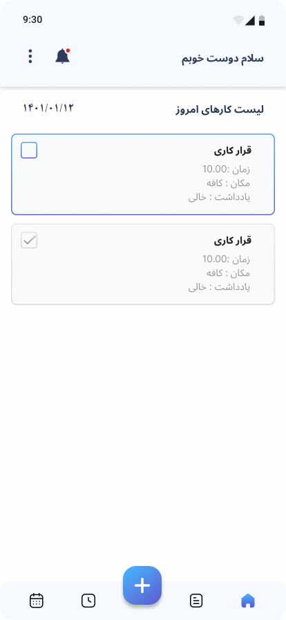
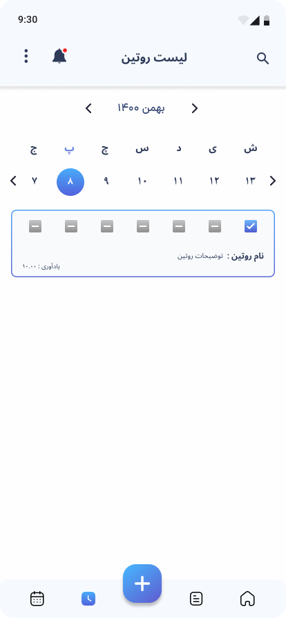
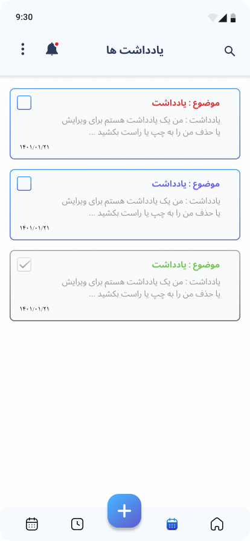
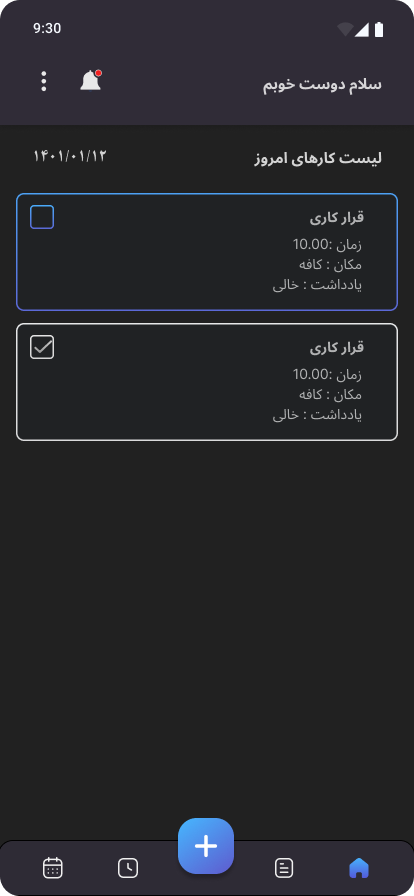
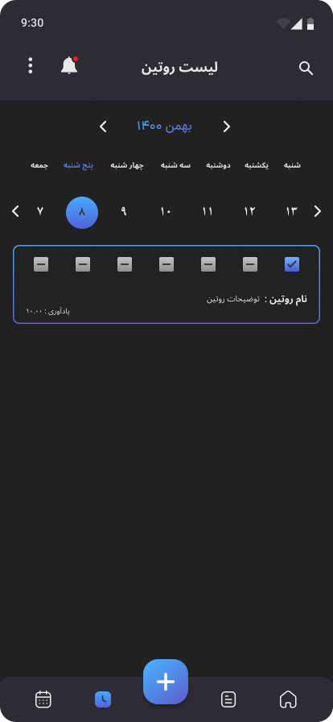
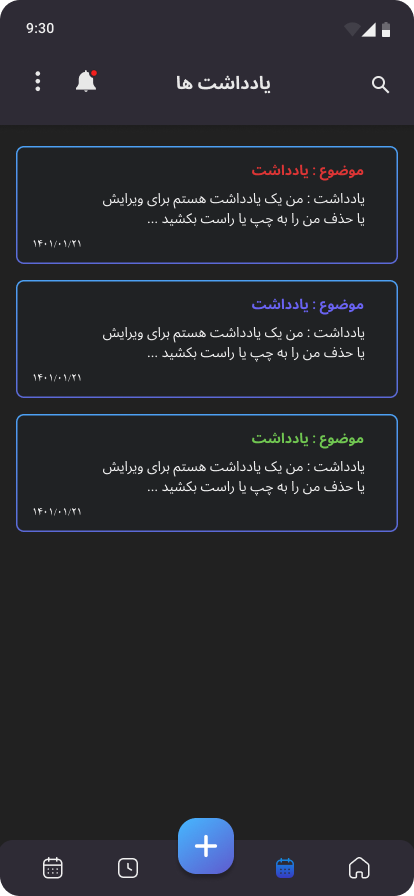

# Welcome to Yadino!
<div align="center">  
  <image height= "100" width ="100" src="asset/logo.png"/></image>
  <br>  
  <strong>Yadino</strong>  
</div>
<br>


[](https://github.com/RahimMahmoudzadeh/Yadino/issues)
<a href="https://android-arsenal.com/api?level=26"></a>


## 📜 Description
Hi! Yadino is a ToDo app the use of MVI Architecture Pattern And Clean Architecture with Jetpack Compose by following Material-3 guidelines along with other MAD libraries such as Dagger-Hilt, Room Database, Coroutines, Navigation etc. for building Android Apps

**You can download the app from Cafe Bazaar or Myket 🚀** <br>  
<a href='https://play.google.com/store/apps/details?id=com.rahim.yadino&hl=en'></a>
<a href='https://cafebazaar.ir/app/com.rahim.yadino'></a>
<a href='https://myket.ir/app/com.rahim.yadino'></a>

## 🛠 Built With  
|  Architecture   |MVI Architecture Pattern |  
|----------------   |------------------------------    |  
|     UI Framework  | [Jetpack Compose](https://www.jetbrains.com/lp/compose-multiplatform/)         |                        |  
| 💉 DI                | [Dagger-Hilt](https://developer.android.com/training/dependency-injection/hilt-android)                        |             |  
| :floppy_disk: Local Database      | [Room Database](https://developer.android.com/topic/libraries/architecture/room)                   |  
| :compass: Navigation       | [Compose Destinations Navigation](https://developer.android.com/jetpack/compose/navigation) |  
| :building_construction: Persistent Background Work  | [AlarmManager](https://developer.android.com/reference/android/app/AlarmManager) |  
| :thread: Asynchronous Work     | [Coroutines](https://kotlinlang.org/docs/reference/coroutines-overview.html)|  
<br>

## 🚀 Features
- **➕ Add, View, Update & Delete Routine and Note**
- **🔔 Notifications:** Receive notifications at the time you set for the routine
- **🌗 Dark/Light Mode:** Toggle between dark and light themes
- **🎨 Dynamic Color:** Enable or disable dynamic color settings

## :iphone: Screenshots (Dark and Light Theme)
<table style="width:100%">
  <tr>
    <th>Home Screen</th>
    <th>Routine Screen</th> 
    <th>Note Screen</th> 
  </tr>
  <tr>
    <td></td> 
    <td></td>
    <td></td>
  </tr>
    <tr>
    <th>Home Screen</th>
    <th>Routine Screen</th> 
    <th>Note Screen</th> 
  </tr>
  <tr>
    <td></td> 
    <td></td>
    <td></td>
  </tr>
</table>
<br>

## 🤝 Contribution
Please read [CONTRIBUTING.md](CONTRIBUTING.md) for details on our code of conduct, and the process for submitting pull requests to us.

## License

```
   Copyright (C) 2023-2024  RahimMahmoudzadeh

    This program is free software: you can redistribute it and/or modify
    it under the terms of the GNU General Public License as published by
    the Free Software Foundation, either version 3 of the License, or
    (at your option) any later version.

    This program is distributed in the hope that it will be useful,
    but WITHOUT ANY WARRANTY; without even the implied warranty of
    MERCHANTABILITY or FITNESS FOR A PARTICULAR PURPOSE.  See the
    GNU General Public License for more details.

    You should have received a copy of the GNU General Public License
    along with this program.  If not, see https://www.gnu.org/licenses/.
```
