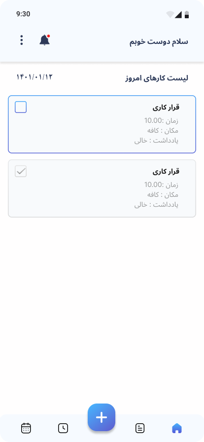
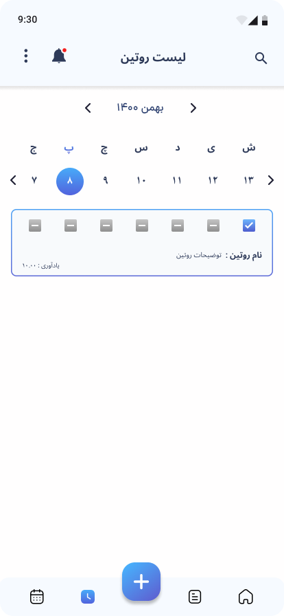
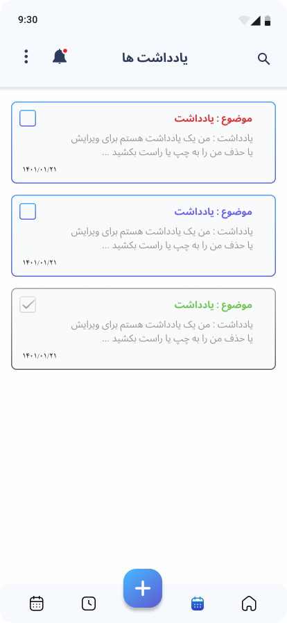
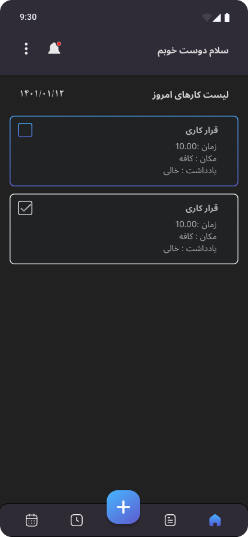
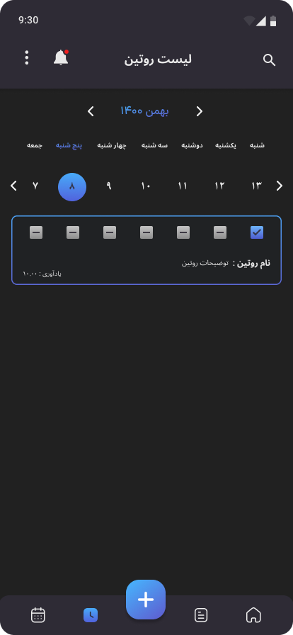
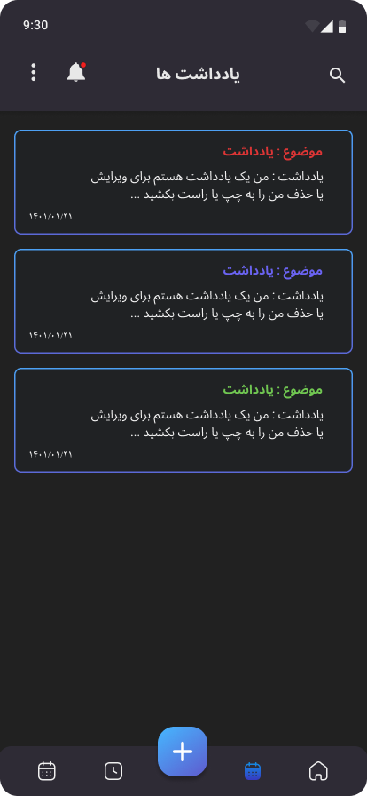

# 📝 Yadino
<div align="center">
  
 
[](https://github.com/RahimMahmoudzadeh/Yadino/issues)
<a href="https://android-arsenal.com/api?level=26"></a>


  <p align="center">
    <b>A modern, feature-rich To-Do & Routine Manager built with the latest Android technologies.</b>
    <br />
    Manage your tasks, set alarms, and organize your day with a beautiful Material 3 UI.
  </p>
</div>

---

## 📖 Overview

**Yadino** is a powerful productivity application designed to help you stay organized. Built with a focus on **Clean Architecture** and **Modern Android Development (MAD)** practices, it leverages the full power of Jetpack Compose for the UI and Decompose for robust navigation.

Whether you need to jot down a quick note, set a recurring routine, or schedule a critical reminder, Yadino handles it with efficiency and style.

## ✨ Key Features

* **📅 Routine Management:** Create, update, and track your daily routines effortlessly.
* **📝 Quick Notes:** Capture thoughts on the go with a simple note-taking interface.
* **⏰ Smart Alarms:** Reliable notifications powered by `AlarmManager` to ensure you never miss a task.
* **🎨 Material 3 Design:** A stunning, adaptive UI that supports both **Light** and **Dark** themes.
* **💾 Offline Capable:** All data is persisted locally using Room Database.

## 📱 Screenshots

<div align="center">
  <table>
    <tr>
      <td></td>
    <td></td>
    <td></td>
    </tr>
    <tr>
      <td></td>
      <td></td>
      <td></td>
    </tr>
  </table>
  </div>

## 🛠 Tech Stack & Libraries

Yadino is built with a strictly modern technology stack, focusing on scalability and performance.

| Category | Library | Description |
| :--- | :--- | :--- |
| **Language** | [Kotlin](https://kotlinlang.org/) | First-class and official programming language for Android development. |
| **UI Toolkit** | [Jetpack Compose](https://developer.android.com/jetpack/compose) | Android’s modern toolkit for building native UI using **Material 3**. |
| **Navigation** | [Decompose](https://arkivanov.github.io/Decompose/) | A Kotlin Multiplatform library for breaking down your code into lifecycle-aware components. |
| **Dependency Injection** | [Koin](https://insert-koin.io/) | A pragmatic lightweight dependency injection framework for Kotlin. |
| **Local Database** | [Room](https://developer.android.com/training/data-storage/room) | The SQLite object mapping library that provides an abstraction layer over SQLite. |
| **Concurrency** | [Coroutines](https://kotlinlang.org/docs/coroutines-overview.html) | For managing background threads and asynchronous tasks. |
| **Scheduling** | [Alarm Manager](https://developer.android.com/develop/background-work/services/alarms) | Used to schedule precise alerts and notifications for user routines. |

## 🏗 Architecture

This project follows **Clean Architecture** principles to separate concerns and ensure testability:

1.  **UI Layer:** Built with Jetpack Compose, driven by ViewModels/Components.
2.  **Domain Layer:** Contains business logic and UseCases.
3.  **Data Layer:** Handles data sources (Room DB) and repositories.

Navigation is handled by **Decompose**, treating screens as components with their own lifecycles, making the app highly modular.

## 🚀 Getting Started

To run this project locally, follow these steps:

1.  **Clone the repository:**
    ```bash
    git clone [https://github.com/RahimMahmoudzadeh/Yadino.git](https://github.com/RahimMahmoudzadeh/Yadino.git)
    ```
2.  **Open in Android Studio:**
    Open the project in the latest version of Android Studio (Koala or later recommended).
3.  **Sync Gradle:**
    Allow the project to sync dependencies.
4.  **Run:**
    Select your emulator or physical device and click **Run**.

## 🤝 Contribution

Contributions are highly welcome! If you have ideas for improvements or bug fixes:

1.  Fork the repository.
2.  Create your feature branch (`git checkout -b feature/AmazingFeature`).
3.  Commit your changes (`git commit -m '#300 Add some AmazingFeature'`).
4.  Push to the branch (`git push origin feature/AmazingFeature`).
5.  Open a Pull Request.

## 📄 License

This project is licensed under the **GPL-3.0 License** - see the [LICENSE](LICENSE) file for details.

---
<div align="center">
  Made with ❤️ by <a href="https://github.com/RahimMahmoudzadeh">Rahim Mahmoudzadeh</a>
</div>
